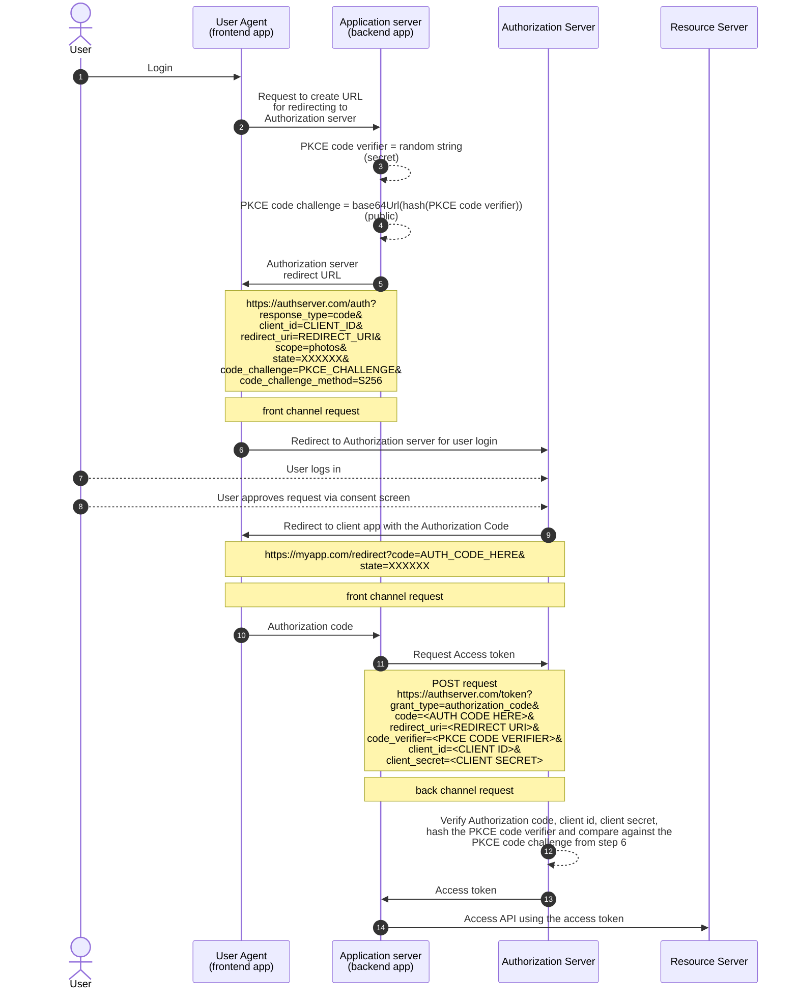

# 9. OAuth for Server-side apps

## Registering OAuth client/Application

- **Client Registration**: Before starting an OAuth flow, the app must be registered with the OAuth server. This process involves creating an identity for the app at the server and receiving credentials (client ID and possibly client secret).

- **Developer Setup**: To register an app, developers typically sign up on the service's developer platform (e.g., Twitter, Google, GitHub) and create an application. This will give them access to credentials used in the OAuth flow.

- **Registration Information**: During registration, you must provide basic app details such as the app name, description, logo, redirect URLs, and possibly terms of service/privacy policy links. This info is used to identify the app and may be visible to users or in logs.

- **Redirect URLs**: It's crucial to register at least one redirect URI. These URLs prevent attackers from hijacking the OAuth flow. Servers should block wildcard redirects to avoid security risks like open redirect attacks.

- **Client ID and Client Secret**:

  - The **client ID** is public and can be included in the source code. It identifies the app during the OAuth flow and determines token policies.
  - The **client secret** is the app's password and must be kept secure. For mobile or JavaScript apps, no client secret is provided because these platforms can't protect it.

- **Security Considerations**:

  - **Client Secret** should never be included in client-side code (e.g., mobile or JavaScript apps) since it can be exposed to attackers.
  - Server-side apps can securely store the client secret in environment variables or configuration files.

- **Next Steps**: Once the app is registered and you have your credentials, you are ready to start the OAuth flow.

## Authorization Code flow for server-side apps (with PKCE)

Goal of this flow is to get the Access token from the Authorization server using the back channel

### Notes for the above diagram

- **Step 3: PKCE code verifier**

  - Random string is 43-128 characters long
  - PKCE code verifier should be kept secret
  - Generated every time the flow is started

- **Step 4: PKCE code challenge**

  - SHA256 Hash the PKCE code verifier
  - Base64 URL encode the hash
  - Meant to be public
  - PKCE was originally developed for mobile apps (public client) but the guidance from the OAuth working group now recommends it for confidential clients as well, such as server-side apps.

    Even with the confidential clients that have the client secret, a subtle attack known as the **Authroization Code Injection** is possible, where authroization codes are swapped to log into someone else's account. Using PKCE solves solves this issue.

- **Step 5: Authorization server redirect URL**

  - This is the authorization server's **Authorization endpoint**
  - `response_type=code` represents the Authorization code flow
  - `client_id` and `redirect_uri` are the values from the client registration. Redirect uri should match the one registered during client registration
  - `scope` is based on the API client wants to access, e.g, photos
  - `state` parameter was originally used for CSRF protection but PKCE also provides that protection. So this parameter can be used to store app-specific info, such as which page to redirect user to after login, e.g. cart or checkout page
  - If the authorization server doesn't support PKCE, then `state` value should be a random string to protect against CSRF
  - `code_challenge` is the PKCE code challenge from step 4 and `code_challenge_method` is the algorithm used for hashing
  - As this is the front channel request, app's server sends the hash of the PKCE code verifier (PKCE code challenge) in the authorization server redirect URL instead of the PKCE code verifier

- **Step 9: Redirect to client app with the Authorization Code**

  - If the `state` parameter (step 5) is being used for CSRF protection, check if the `state` query parameter value returned in the client redirect URL is same as the one used in the request

- **Step 11: Request Access token**

  - POST request from back channel to the authorization server's **Token endpoint**
  - Request parameters are sent in the traditional form-encoded POST body
  - Different servers expect the request parameters in the POST request body or in the HTTP Basic Auth header (check server docs)

- **Step 13: Access token**
  - Access token response may contain the refresh token
  - It can be used to get a new access token if the access token expires
  - If the refresh token request to get a new access token fails, complete OAuth flow has to be attemped from the start

- [Previous -> 8. Application Identity](08.%20Application%20Identity.md)
- [Next -> 10. OAuth for Mobile apps](10.%20OAuth%20for%20Mobile%20apps.md)
