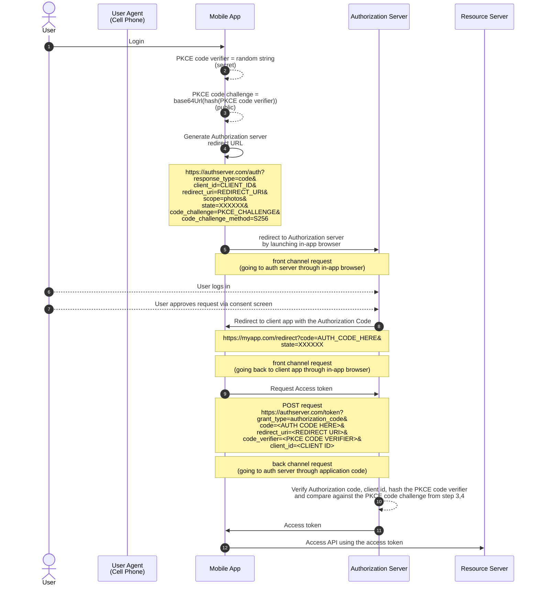

# 10. OAuth for Mobile apps

## Issues in mobile apps

- **Problem with Client Secrets in Mobile Apps**: Including client secrets in mobile apps is unsafe because the secret would be exposed in the app's source code, which is accessible to anyone who decompiles the app.

- **Security Risk**: Tools exist to decompile mobile app binaries, meaning the client secret would no longer remain secret if included in the app.

- **Solution for Mobile Apps**: The solution to this problem is not to use a client secret in mobile apps at all.

## Redirect URLs for mobile apps

- **OAuth Redirect URL Security in Mobile Apps**: Mobile apps face unique security challenges regarding how redirect URLs are handled during the OAuth flow, specifically on iOS and Android platforms.

- **Redirect URL in Web Apps**: In web apps, the authorization flow happens within the browser, which offers security protections like DNS validation and HTTPS checks.

- **Security Issues in Mobile Apps**: Mobile apps lose many of the browser's security protections. When a mobile app launches an in-app browser for OAuth, the authorization server redirects back to the app, but this redirect can be intercepted.

- **Old Method – Custom URL Schemes**: Early mobile apps used custom URL schemes to handle redirects, but there was no registry for these schemes. One or more apps could claim the same scheme, leading to potential conflicts and security risks where one app could intercept another's redirect.

- **New Method – Deep Linking**: A more modern approach is using deep linking, where apps claim URL patterns, including domain names or paths. This method is more secure because the app developer must prove ownership of the domain.

- **Deep Linking Security**: Deep linking offers more security, as mobile platforms verify domain ownership, reducing the risk of other apps intercepting the redirect.

- **Uncertainty in Redirect URL Handling**: Despite improvements, the redirect URL handling in mobile apps is still not as secure as in browsers. The OAuth server cannot guarantee that the redirect will be received by the intended app.

- **PKCE Importance**: PKCE (Proof Key for Code Exchange) is crucial in mobile app security to prevent interception of authorization codes during redirects.

- **Best Practice**: It's generally safer to use app-claimed URL patterns (deep linking) in mobile apps, as these can be verified by mobile platforms, reducing the risk of redirect conflicts or interception.

## Browser security for mobile apps

- **Mobile OAuth Security Challenge**: The process of launching a browser to initiate OAuth flow has been a challenge in mobile apps, particularly in the past.

- **Old Approach – Native Browser Launch**: Initially, the most secure method was to launch the native browser (Safari on iOS, Chrome on Android) to handle OAuth. This would require the user to leave the app, log in, and then return, resulting in a less-than-ideal user experience.

- **Problems with Embedding Web Views**:

  - **Lack of Address Bar**: When apps embedded a web view (instead of using a native browser), users couldn't verify the authenticity of the authorization server, risking phishing attacks.
  - **No Cookie Sharing**: Web views don’t share cookies with system browsers, leading to poor user experience since users had to log in repeatedly.
  - **Password Access Risk**: Web views give apps full control, so they could potentially extract the user's password, undermining OAuth’s goal of keeping passwords secure.
  - **Lack of Secure Authentication**: Secure authentication mechanisms like WebAuthn or TouchID aren’t available in web views.

- **Improved Mobile OAuth with APIs**:

  - Mobile platforms have since introduced secure APIs for OAuth flow.
  - **Secure Browser Launch**: These APIs allow mobile apps to launch a browser securely within the app, ensuring the user never leaves the app, while maintaining the security of the login process.

- **Benefits of New Method**:

  - **Improved User Experience**: Users no longer need to leave the app and don’t have to repeatedly enter their password if they’re already logged in to the authorization server (e.g., via Safari).
  - **Enhanced Security**: Since the app doesn't have access to the browser, it cannot extract sensitive information like passwords. The app also can't inspect the browser contents, ensuring better privacy.

- **Examples of Secure OAuth Flow on Mobile**:

  - On iOS, this is achieved with **SFSafariViewController**.
  - On Android, a similar feature is **Chrome Custom Tabs**.

- **Best Practice**: Using these secure APIs (SFSafariViewController on iOS, Chrome Custom Tabs on Android) is the best approach for OAuth in mobile apps, offering a good balance between security and user experience.

## Registering mobile App as an OAuth Client

- In the case of mobile apps, there is no secure way to handle **client secrets**. So during the client registration with the **Authorization server**, the server might not even provide the **client secret** in the case of mobile app.

- So in the case of mobile apps, the OAuth flow will be performed with only the **client id**, and the **client secret** will not be used.

## Authorization Code flow for mobile apps (with PKCE)

Goal of this flow is to get the Access token from the Authorization server, ideally using the back channel. The back channel in this case means the request made from the code of the mobile application to the Authorization server.



### Notes for the above diagram

- **Step 2: PKCE code verifier**

  - Random string is 43-128 characters long
  - PKCE code verifier should be kept secret
  - Generated every time the flow is started

- **Step 3: PKCE code challenge**

  - SHA256 Hash the PKCE code verifier
  - Base64 URL encode the hash
  - Meant to be public
  - PKCE was originally developed for mobile apps (public client) because there is no client secret.

- **Step 4: Authorization server redirect URL**

  - This is the authorization server's **Authorization endpoint**
  - `response_type=code` represents the Authorization code flow
  - `client_id` and `redirect_uri` are the values from the client registration. Redirect uri should match the one registered during client registration
  - `scope` is based on the API client wants to access, e.g, photos
  - `state` parameter was originally used for CSRF protection but PKCE also provides that protection. So this parameter can be used to store app-specific info
  - If the authorization server doesn't support PKCE, then `state` value should be a random string to protect against CSRF
  - `code_challenge` is the PKCE code challenge from step 3 and `code_challenge_method` is the algorithm used for hashing
  - As this is the front channel request, mobile app sends the hash of the PKCE code verifier (PKCE code challenge) in the authorization server redirect URL instead of the PKCE code verifier

- **Step 8: Redirect to client app with the Authorization Code**

  - If the `state` parameter (step 4) is being used for CSRF protection, check if the `state` query parameter value returned in the client redirect URL is same as the one used in the request

- **Step 9: Request Access token**

  - POST request from back channel to the authorization server's **Token endpoint**
  - Request parameters are sent in the traditional form-encoded POST body
  - Different servers expect the request parameters in the POST request body or in the HTTP Basic Auth header (check server docs)

- **Step 13: Access token**
  - Access token response may contain the refresh token
  - It can be used to get a new access token if the access token expires
  - If the refresh token request to get a new access token fails, complete OAuth flow has to be attemped from the start

## Refresh tokens for mobile apps

- **Purpose of Refresh Tokens**: Refresh tokens are used to obtain new access tokens without requiring user involvement. This allows access tokens to expire quickly while keeping the user logged in.

- **Improved User Experience**: Refresh tokens prevent the need for users to log in repeatedly, especially on mobile apps, where prompting users to reauthenticate via in-app browsers can be disruptive.

- **Requesting a Refresh Token**:

  - The app may need to explicitly request a refresh token, often using the `offline_access` scope.
  - Some servers may return refresh tokens automatically, while others may have specific policies on when and to whom they grant refresh tokens.

- **Using Refresh Tokens**:

  - When the access token expires, the app uses the refresh token to request a new access token by sending a POST request to the token endpoint.
  - The request includes the `grant_type=refresh_token`, the refresh token, and the app's client ID (without a client secret, as native apps don't use secrets).

    ```curl
    https://authserver.com/auth?
          grant_type=refresh_token&
          refresh_token=<REFRESH_TOKEN>
          client_id=<CLIENT_ID>
    ```

- **Security Considerations**:

  - Since refresh tokens allow obtaining new access tokens, they must be protected. If a refresh token is stolen, it could be used to generate new access tokens, just like the real app could.
  - Mobile platforms help protect refresh tokens by isolating apps from each other.
  - There is a secure storage API on mobile devices that can protect refresh tokens from being accessed by the app's code.

- **Example Workflow**:

  1. Upon app launch, the user signs in, and the app receives both an access token and a refresh token.
  1. The access token is used for API requests, while the refresh token is stored securely using the device’s secure storage API.
  1. When the user opens the app again after the access token expires, the app shows the signin prompt. When the user clicks the signin button, the app can see that there is a refresh token in the secure storage but it can't access it yet. So the app prompts for biometrics (e.g., FaceID or fingerprint) to unlock the secure storage, making the refresh token available to the application code. The app can use the refresh token to obtain a new access token.

  1. This process provides a seamless experience without needing the user to enter their password or interact with a browser.

- **Benefits**:

  - The refresh token is securely stored and only accessible when needed, improving security.
  - Users experience a seamless login flow with minimal interruptions, enhancing the overall user experience.

<hr>

- [Previous -> 9. OAuth for Server-side apps](9.%20OAuth%20for%20Server-side%20apps.md)
- [Next -> 11. OAuth for Single Page apps](11.%20OAuth%20for%20Single%20Page%20apps.md)
