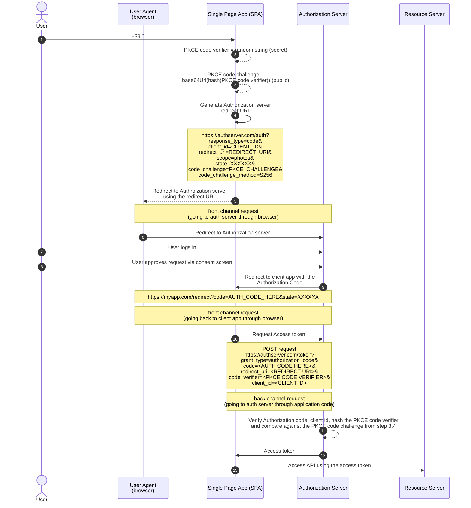

# 11. OAuth for Single Page apps

## Problems with the browser environment

- **Challenges with OAuth in Single-Page Apps**: Single-page apps (SPAs) in browsers face several challenges in implementing OAuth securely due to the nature of JavaScript and browser vulnerabilities.

- **Public Clients**: JavaScript apps are considered "public clients" in OAuth because credentials like API keys or client secrets cannot be securely stored in the app. They are visible to anyone who can view the app’s source code.

- **PKCE for OAuth**: Since JavaScript apps cannot securely use client secrets, the PKCE (Proof Key for Code Exchange) extension is used to secure OAuth flows without needing a client secret.

- **Cross-Site Scripting (XSS) Attacks**:

  - XSS attacks allow attackers to run malicious code within the app, potentially stealing data like access tokens and making unauthorized API requests.
  - Protecting against XSS requires a strong Content Security Policy (CSP), but balancing security with functionality (e.g., allowing third-party JavaScript for analytics) is difficult.

- **Third-Party JavaScript Risks**:

  - Third-party JavaScript (e.g., for analytics or ads) can introduce vulnerabilities if compromised.
  - Any external scripts or libraries included in the app can become attack vectors.

- **Browser Extensions Risks**:

  - Users’ browser extensions may inject JavaScript into the page, which can potentially snoop on the app's data, even if the app has a strong CSP and does not load external scripts.

- **Lack of Secure Storage in Browsers**:

  - Browsers lack a secure storage API, making it difficult to securely store client secrets or tokens like access or refresh tokens.
  - Common storage options like cookies, LocalStorage, or SessionStorage are accessible by JavaScript, which makes them vulnerable if an XSS attack occurs.

- **OAuth Policies for SPAs**:

  - Due to browser vulnerabilities, OAuth servers may have stricter policies for SPAs, such as disabling refresh tokens, limiting token lifetimes, or making refresh tokens one-time use to reduce risk in case tokens are leaked.

## Registering mobile App as an OAuth Client

- In the case of mobile apps, there is no secure way to handle **client secrets**. So during the client registration with the **Authorization server**, the server might not even provide the **client secret** in the case of mobile app.

- So in the case of mobile apps, the OAuth flow will be performed with only the **client id**, and the **client secret** will not be used.

## Authorization Code flow for mobile apps (with PKCE)

Goal of this flow is to get the Access token from the Authorization server, ideally using the back channel. The back channel in this case means the request made from the code of the mobile application to the Authorization server.

### Notes for the above diagram

- **Step 2: PKCE code verifier**

  - Random string is 43-128 characters long
  - PKCE code verifier should be kept secret
  - Generated every time the flow is started

- **Step 3: PKCE code challenge**

  - SHA256 Hash the PKCE code verifier
  - Base64 URL encode the hash
  - Meant to be public
  - PKCE was originally developed for mobile apps (public client) because there is no client secret.

- **Step 4: Authorization server redirect URL**

  - This is the authorization server's **Authorization endpoint**
  - `response_type=code` represents the Authorization code flow
  - `client_id` and `redirect_uri` are the values from the client registration. Redirect uri should match the one registered during client registration
  - `scope` is based on the API client wants to access, e.g, photos
  - `state` parameter was originally used for CSRF protection but PKCE also provides that protection. So this parameter can be used to store app-specific info
  - If the authorization server doesn't support PKCE, then `state` value should be a random string to protect against CSRF
  - `code_challenge` is the PKCE code challenge from step 3 and `code_challenge_method` is the algorithm used for hashing
  - As this is the front channel request, the single page web app sends the hash of the PKCE code verifier (PKCE code challenge) in the authorization server redirect URL instead of the PKCE code verifier

- **Step 9: Redirect to client app with the Authorization Code**

  - If the `state` parameter (step 4) is being used for CSRF protection, check if the `state` query parameter value returned in the client redirect URL is same as the one used in the request

- **Step 10: Request Access token**

  - POST request from back channel to the authorization server's **Token endpoint**
  - Request parameters are sent in the traditional form-encoded POST body
  - Different servers expect the request parameters in the POST request body or in the HTTP Basic Auth header (check server docs)

- **Step 12: Access token**
  - Access token response may contain the refresh token
  - It can be used to get a new access token if the access token expires
  - If the refresh token request to get a new access token fails, complete OAuth flow has to be attemped from the start

## Protecting tokens in the browser

- **OAuth and PKCE**: PKCE (Proof Key for Code Exchange) is the most secure way to complete an OAuth flow, ensuring only the application that initiated the flow can complete it and receive the access token.

- **Token Storage Challenge**: After the OAuth flow, securing the access token in the browser becomes a concern, as browsers are less secure than servers or mobile apps. The risk of cross-site scripting (XSS) attacks is a major security concern when storing tokens in the browser.

- **Browser Storage Options**:

  - **LocalStorage**: Persistent storage, data lasts beyond browser sessions and is shared between tabs, but accessible to JavaScript, making it vulnerable to XSS.
  - **SessionStorage**: Data persists only as long as the window is open and isn't shared between tabs, but still vulnerable to XSS.
  - **Cookies**: Older option, usually used for automatic backend requests, but not ideal for app storage. JavaScript access to cookies can be risky.

- **Cross-Site Scripting Risk**: Any JavaScript in your app, even from different domains, can access LocalStorage, SessionStorage, and cookies, making these storage options risky for sensitive tokens in the event of an XSS vulnerability.

- **Alternative Token Storage Options**:

  - **In-Memory Storage**: Keeps tokens in memory, reducing risk but not allowing tokens to persist across tabs or page refreshes.
  - **Service Worker Storage**: More secure as it isolates storage from the main browser window, preventing access by malicious JavaScript. However, it requires more complex setup and doesn't work in IE11.
  - **WebCrypto API**: Allows generating and using a private key to encrypt tokens, providing more security than plain text storage, but not available in all browsers and still not foolproof.

- **Best Security Practice**: The safest approach to token security is to avoid giving tokens to JavaScript at all

## Securing the Browser with a Backend

- **Security Concern with JavaScript Apps**:

  - Data in JavaScript apps is vulnerable to cross-site scripting (XSS) attacks, making access tokens at risk of being stolen if stored in the app.

- **Solution: Move OAuth Flow and Token Storage to the Backend**:

  - By moving the OAuth flow and token storage to a backend server, the access token is never exposed to the JavaScript app, reducing security risks.

- **When This Solution Works**:

  - This approach works if you have a backend server (e.g., .NET, Java app) serving your single-page app.
  - It is not suitable for static hosting scenarios (e.g., using Amazon S3 with direct API calls from the JavaScript app).

- **OAuth Flow with a Backend**:
  - The app redirects the user to the authorization server for login.
  - After logging in, the authorization server redirects the user back to the app’s website, delivering an authorization code.
  - The JavaScript app sends the authorization code to the backend server.
  - The backend server exchanges the authorization code for an access token via a secure back channel (server-to-server communication).

6. **Session Management with HTTPOnly Cookies**:

   - The backend stores the access token securely and sends a session cookie to the browser (with the HTTPOnly flag, preventing access by JavaScript).
   - API requests from the browser include the session cookie, and the backend uses the session to look up the access token and make the API request.

7. **Benefits of This Approach**:

   - The access token and refresh token are kept out of the browser, ensuring they are not exposed to JavaScript.
   - The backend server is considered a "confidential client" and can use a client secret for added security.

8. **OAuth for Browser-Based Apps Specification**:

   - This pattern is recommended in the new OAuth for Browser-Based App spec as a secure method for handling tokens in browser-based apps.

9. **Summary**:
   - If your single-page app has a dynamic backend, this approach is much safer than handling access tokens directly in the JavaScript app.

- [Previous -> 10. OAuth for Mobile apps](10.%20OAuth%20for%20Mobile%20apps.md)
- [Next -> 12. OAuth for the Internet of Things](12.%20OAuth%20for%20the%20Internet%20of%20Things.md)
